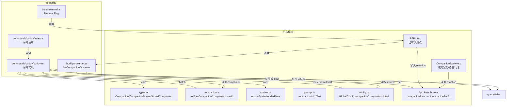
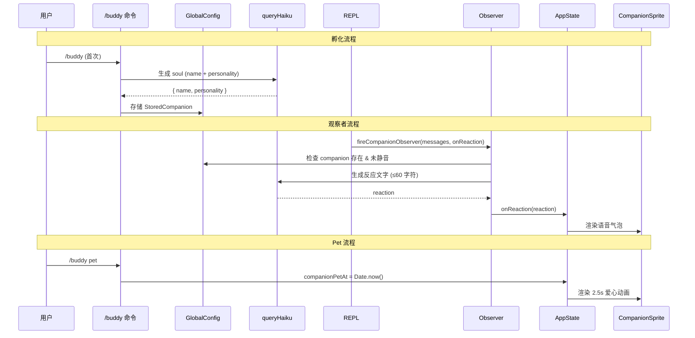

# 技术设计文档：Buddy Completion

## 概述

本设计文档描述 buddy（终端宠物伴侣系统）三个缺失模块的技术实现方案：

1. `/buddy` 命令模块（`src/commands/buddy/`）— 包含 hatch、pet、card、mute、unmute、off 子命令
2. Companion 观察者（`src/buddy/observer.ts`）— 在 AI 回复后生成 companion 反应文字
3. Feature Flag 启用 — 将 BUDDY 从 `EXTERNAL_DISABLED_FEATURES` 移到 `ENABLED_FEATURES`

渲染层（CompanionSprite、sprites）和数据层（types、companion、prompt）已完整实现，本设计聚焦于将这些模块串联起来。

## 架构



### 设计决策

1. **命令类型选择 `local-jsx`**：buddy 命令需要渲染 JSX（孵化动画、属性卡片），与项目中其他交互式命令（theme、config、tag）保持一致。

2. **使用 `queryHaiku` 进行 AI 调用**：孵化流程的 soul 生成和观察者的反应生成都使用 `queryHaiku`（小模型快速调用），与 `generateSessionTitle` 等现有模式一致，避免占用主对话的 token 预算。

3. **观察者采用 fire-and-forget 模式**：`fireCompanionObserver` 返回 `Promise<void>`，REPL 中通过 `void` 调用，失败静默忽略，不阻塞主流程。

4. **Bones 不持久化**：遵循现有设计，bones 每次从 `hash(userId)` 重新生成，只有 soul（name、personality、hatchedAt）持久化到 `GlobalConfig.companion`。


## 组件与接口

### 1. `/buddy` 命令模块

#### `src/commands/buddy/index.ts` — 命令注册

```typescript
import type { Command } from '../../commands.js'

const buddy = {
  type: 'local-jsx',
  name: 'buddy',
  description: 'Manage your terminal companion',
  isEnabled: () => true,
  argumentHint: '[hatch|pet|card|mute|unmute|off]',
  load: () => import('./buddy.js'),
} satisfies Command

export default buddy
```

遵循项目中 `tag`、`theme` 等命令的标准模式：`index.ts` 负责注册，实现文件通过 `load()` 懒加载。

#### `src/commands/buddy/buddy.tsx` — 命令实现

导出 `call` 函数，签名符合 `LocalJSXCommandCall`：

```typescript
export async function call(
  onDone: LocalJSXCommandOnDone,
  context: LocalJSXCommandContext,
  args: string,
): Promise<React.ReactNode>
```

子命令路由逻辑：

| 子命令 | 行为 |
|--------|------|
| （无参数，无 companion） | 启动孵化流程 |
| （无参数，有 companion） | 显示属性卡片 |
| `pet` | 设置 `AppState.companionPetAt = Date.now()` |
| `card` | 渲染完整属性卡片 |
| `mute` | 设置 `GlobalConfig.companionMuted = true` |
| `unmute` | 设置 `GlobalConfig.companionMuted = false` |
| `off` | 清除 `GlobalConfig.companion` |
| 其他 | 显示帮助信息 |

#### 孵化流程组件 `<HatchFlow />`

1. 调用 `roll(companionUserId())` 获取 bones
2. 调用 `queryHaiku` 生成 soul（name + personality）
3. 渲染孵化动画（加载指示器 + ASCII 蛋动画）
4. 将 `{ name, personality, hatchedAt: Date.now() }` 存入 `GlobalConfig.companion`
5. 显示完整属性卡片

#### 属性卡片组件 `<CompanionCard />`

渲染内容：
- ASCII 精灵（`renderSprite(bones)`）
- 名称 + 物种
- 稀有度星级（`RARITY_STARS[rarity]`）+ 稀有度颜色（`RARITY_COLORS[rarity]`）
- 五维属性条（DEBUGGING、PATIENCE、CHAOS、WISDOM、SNARK），每个属性用可视化进度条展示
- 性格描述（personality）

### 2. Companion 观察者

#### `src/buddy/observer.ts`

```typescript
export async function fireCompanionObserver(
  messages: Message[],
  onReaction: (reaction: string) => void,
): Promise<void>
```

流程：
1. 调用 `getCompanion()` 检查 companion 是否存在
2. 检查 `getGlobalConfig().companionMuted` 是否为 true
3. 若不满足条件，直接 return
4. 提取最近对话消息的文本摘要
5. 构造 prompt，包含 companion 的 personality 和 stats
6. 调用 `queryHaiku` 生成不超过 60 字符的反应文字
7. 调用 `onReaction(reaction)` 传递结果
8. 所有错误静默捕获，不影响主流程

### 3. Feature Flag 变更

#### `scripts/build-external.ts`

- 从 `EXTERNAL_DISABLED_FEATURES` 数组中移除 `"BUDDY"`
- 将 `"BUDDY"` 添加到 `ENABLED_FEATURES` 数组中

变更后 `feature('BUDDY')` 在运行时返回 `true`，所有已有的条件分支（REPL 中的 CompanionSprite 渲染、observer 调用、useBuddyNotification 等）自动生效。


## 数据模型

### 已有数据模型（无需修改）

#### `StoredCompanion`（持久化到 `~/.claude.json`）

```typescript
type StoredCompanion = {
  name: string        // AI 生成的名字
  personality: string // AI 生成的性格描述
  hatchedAt: number   // 孵化时间戳
}
```

#### `CompanionBones`（运行时从 userId 派生）

```typescript
type CompanionBones = {
  rarity: Rarity           // 'common' | 'uncommon' | 'rare' | 'epic' | 'legendary'
  species: Species         // 18 种物种之一
  eye: Eye                 // 6 种眼睛样式之一
  hat: Hat                 // 8 种帽子之一（common 无帽子）
  shiny: boolean           // 1% 概率闪光
  stats: Record<StatName, number>  // 五维属性，1-100
}
```

#### `Companion`（运行时完整对象）

```typescript
type Companion = CompanionBones & CompanionSoul & { hatchedAt: number }
```

#### `GlobalConfig` 相关字段

```typescript
{
  companion?: StoredCompanion    // 持久化的 soul 数据
  companionMuted?: boolean       // 是否静音
}
```

#### `AppState` 相关字段

```typescript
{
  companionReaction?: string     // 当前反应文字（由 observer 写入）
  companionPetAt?: number        // 最近一次 pet 的时间戳
}
```

### 数据流




## 正确性属性

*属性（property）是在系统所有有效执行中都应成立的特征或行为——本质上是对系统应做什么的形式化陈述。属性是人类可读规范与机器可验证正确性保证之间的桥梁。*

### 属性 1：未识别子命令一律返回帮助

*对于任意* 不属于已知子命令集合 `{pet, card, mute, unmute, off}` 的字符串，命令路由函数应返回帮助信息，而非执行任何副作用操作。

**验证: 需求 1.8**

### 属性 2：属性条渲染与数值成正比

*对于任意* 1 到 100 之间的整数值，属性条渲染函数生成的填充字符数量应与输入值成正比（在给定的总宽度内），且填充字符数 + 空白字符数 = 总宽度。

**验证: 需求 3.2**

### 属性 3：Observer 守卫条件正确性

*对于任意* companion 状态（存在/不存在）和 muted 状态（true/false）的组合，`fireCompanionObserver` 应仅在 companion 存在且 companionMuted 为 false 时才尝试调用 AI 生成反应；其他情况下应直接返回且不调用 onReaction 回调。

**验证: 需求 4.2**


## 错误处理

### 孵化流程 AI 调用失败

- `queryHaiku` 抛出异常时，`<HatchFlow />` 组件捕获错误
- 向用户显示错误信息（如 "生成 companion 失败，请重试"）
- 调用 `onDone` 关闭命令 UI，不写入任何 config 数据
- 不影响已有的 companion 数据

### Observer AI 调用失败

- `fireCompanionObserver` 内部 try-catch 包裹整个 AI 调用
- 异常时静默忽略（不 log 到用户可见的输出）
- 不调用 `onReaction` 回调
- 不影响主 REPL 流程

### Config 写入失败

- `saveGlobalConfig` 内部已有完善的错误处理（锁机制、auth 状态保护）
- mute/unmute/off 操作失败时，通过 `onDone` 向用户显示错误信息

### 无 Companion 时的命令处理

- `pet`、`card`、`mute`、`unmute` 在无 companion 时应提示用户先执行 `/buddy` 孵化
- `off` 在无 companion 时为空操作，直接返回

## 测试策略

### 单元测试

使用项目现有的测试框架（Vitest），重点覆盖：

1. **命令路由测试**
   - 各子命令正确分发
   - 无参数时根据 companion 状态分支
   - 未识别子命令返回帮助

2. **属性卡片渲染测试**
   - 属性条渲染函数的输入输出
   - 卡片包含所有必要元素

3. **Observer 守卫条件测试**
   - companion 不存在时直接返回
   - companionMuted 为 true 时直接返回
   - AI 调用失败时静默处理

4. **Config 操作测试**
   - mute/unmute 正确设置 companionMuted
   - off 正确清除 companion
   - hatch 正确存储 StoredCompanion

### 属性测试

使用 `fast-check` 库，最少 100 次迭代：

1. **Feature: buddy-completion, Property 1: 未识别子命令一律返回帮助**
   - 生成随机字符串（排除已知子命令）
   - 验证路由函数返回帮助结果

2. **Feature: buddy-completion, Property 2: 属性条渲染与数值成正比**
   - 生成 1-100 的随机整数
   - 验证填充字符数 = round(value / 100 * totalWidth)
   - 验证填充 + 空白 = totalWidth

3. **Feature: buddy-completion, Property 3: Observer 守卫条件正确性**
   - 生成随机的 companion 存在/不存在和 muted 状态
   - 使用 mock AI 和 mock config
   - 验证只有 companion 存在且未静音时才调用 AI

### 集成测试

1. **孵化端到端流程**（mock AI）
   - 验证从无 companion 到有 companion 的完整流程

2. **Feature Flag 验证**
   - 验证构建配置变更后 `feature('BUDDY')` 返回 true

### 测试不覆盖的范围

- CompanionSprite 的动画渲染（已有模块，不在本次范围内）
- queryHaiku 的实际 AI 响应质量（外部服务行为）
- REPL 中的完整集成（需要完整应用环境）
