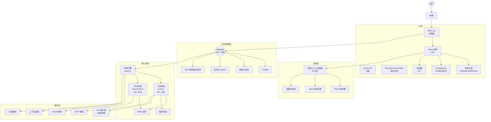
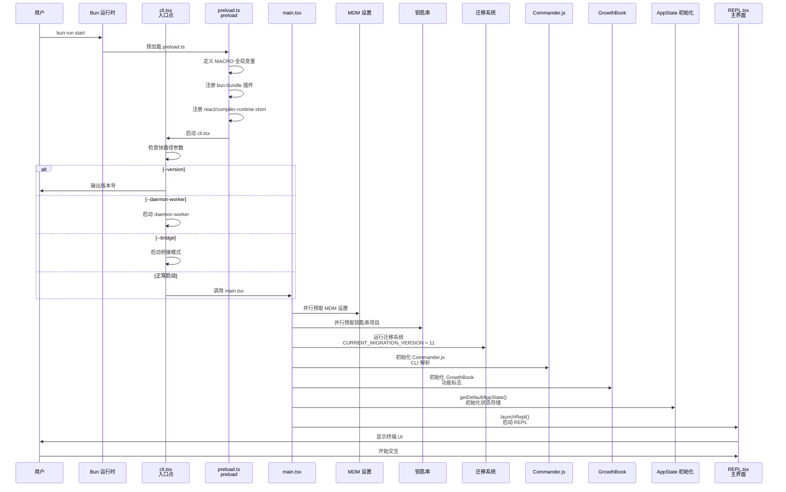
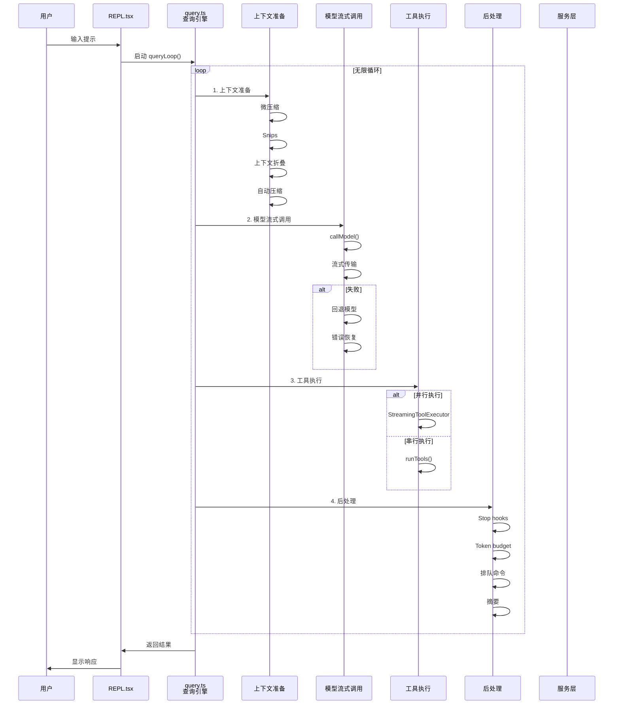
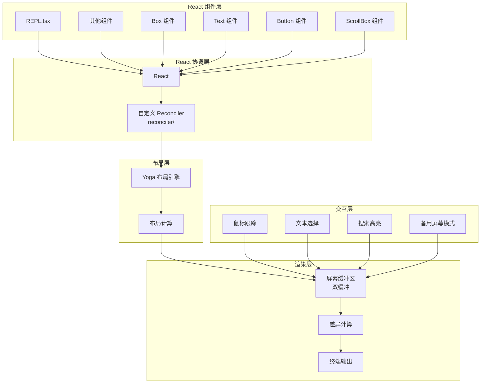
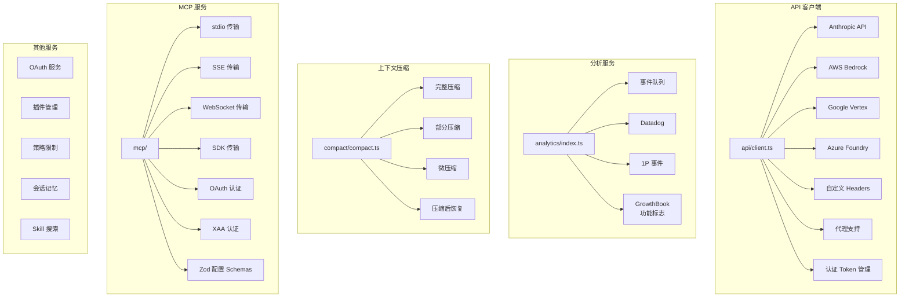

# Claude Code Rebuilt - 完整项目架构分析

> 本文档从架构师角度深度解析 Claude Code Rebuilt 项目

---

## 目录

1. [项目概述](#项目概述)
2. [技术栈](#技术栈)
3. [目录结构](#目录结构)
4. [核心架构](#核心架构)
5. [功能模块清单](#功能模块清单)
6. [关键系统详解](#关键系统详解)
7. [构建系统](#构建系统)

---

## 项目概述

**Claude Code Rebuilt** 是 Anthropic 的 Claude Code CLI 的完整重构版本。原始源代码在 2026 年 3 月 31 日通过 npm 注册表的 source map 文件泄露，仅包含 `src/` 目录。本项目重建了所有缺失的部分：

- `package.json` 和 `tsconfig.json`
- 构建脚本
- 185+ 个 stub/类型文件
- 内部包的兼容性 shims
- `bun:bundle` 功能标志运行时

### 关键特性

- ✅ 完整可构建、可运行的终端应用
- ✅ 交互式 REPL、工具系统、Anthropic API 集成
- ❌ 内部 Anthropic 功能（daemon、voice、computer-use 等）通过功能标志在构建时禁用

---

## 技术栈

| 类别 | 技术 | 说明 |
|------|------|------|
| **语言** | TypeScript (strict mode) | 512K+ 行代码 |
| **运行时** | Bun | v1.3.11+ |
| **终端 UI** | React + 自定义 Ink | 完整的终端渲染引擎 |
| **CLI 解析** | Commander.js + extra-typings | 类型安全的 CLI |
| **模式验证** | Zod | 配置和输入验证 |
| **协议** | MCP SDK, LSP | Model Context Protocol |
| **API** | Anthropic SDK, Bedrock, Vertex | 多提供商支持 |
| **认证** | OAuth 2.0, API Key, macOS Keychain | |

---

## 目录结构

```
claude-code-rebuilt/
├── src/
│   ├── entrypoints/
│   │   └── cli.tsx                    # 进程入口点
│   ├── main.tsx                       # Commander CLI 设置，REPL 启动
│   ├── commands.ts                    # 斜杠命令注册表
│   ├── tools.ts                       # 工具注册表
│   ├── Tool.ts                        # 基础工具类型定义
│   ├── query.ts                       # LLM 查询引擎
│   │
│   ├── ink/                           # 自定义 Ink 终端渲染器 (52 文件)
│   │   ├── reconciler/                # React 协调器
│   │   ├── components/                # Ink 内置组件
│   │   └── ...
│   │
│   ├── components/                    # React 终端 UI 组件 (146+)
│   │   ├── messages/                  # 消息渲染
│   │   ├── permissions/               # 权限对话框
│   │   ├── mcp/                       # MCP 相关组件
│   │   ├── PromptInput/               # 提示输入
│   │   └── ...
│   │
│   ├── screens/                       # 全屏 UI
│   │   ├── REPL.tsx                   # 主交互界面
│   │   ├── Doctor.tsx                 # 系统诊断
│   │   └── ResumeConversation.tsx     # 恢复对话
│   │
│   ├── services/                      # 核心服务 (41+)
│   │   ├── api/                       # API 客户端 (多提供商)
│   │   ├── analytics/                 # 分析和遥测
│   │   ├── compact/                   # 上下文压缩
│   │   ├── mcp/                       # MCP 协议客户端
│   │   ├── policyLimits/              # 策略限制
│   │   └── ...
│   │
│   ├── hooks/                         # React Hooks (87+)
│   │   ├── useTimeout.ts
│   │   ├── useAppState.ts
│   │   └── ...
│   │
│   ├── utils/                         # 工具函数 (335+)
│   │   ├── auth.ts                    # 认证
│   │   ├── claudemd.ts                # CLAUDE.md 解析
│   │   ├── settings/                  # 设置管理
│   │   ├── model/                     # 模型管理
│   │   ├── swarm/                     # 多 agent 后端
│   │   └── ...
│   │
│   ├── tools/                         # 工具实现 (50+)
│   │   ├── AgentTool/
│   │   ├── BashTool/
│   │   ├── FileReadTool/
│   │   ├── FileEditTool/
│   │   ├── FileWriteTool/
│   │   ├── GlobTool/
│   │   ├── GrepTool/
│   │   ├── WebSearchTool/
│   │   ├── WebFetchTool/
│   │   ├── TaskCreateTool/
│   │   ├── EnterPlanModeTool/
│   │   ├── SkillTool/
│   │   └── ...
│   │
│   ├── commands/                      # 斜杠命令实现 (100+)
│   │   ├── init/
│   │   ├── help/
│   │   ├── model/
│   │   ├── commit/
│   │   ├── review/
│   │   ├── plan/
│   │   └── ...
│   │
│   ├── skills/                        # Skills 系统
│   │   ├── bundledSkills.ts           # 内置 skills (18+)
│   │   ├── loadSkillsDir.ts           # 目录加载
│   │   └── ...
│   │
│   ├── plugins/                       # 插件系统
│   │   ├── builtinPlugins.ts          # 内置插件
│   │   └── ...
│   │
│   ├── state/                         # 状态管理
│   │   ├── AppState.ts                # 应用状态 (450+ 字段)
│   │   └── onChangeAppState.ts        # 状态变更处理
│   │
│   ├── context/                       # React Context (9 个)
│   │   ├── fpsMetrics.ts
│   │   ├── stats.ts
│   │   └── ...
│   │
│   ├── types/                         # 类型定义
│   │   ├── message.ts                 # 消息类型
│   │   ├── command.ts
│   │   ├── tools.ts
│   │   └── ...
│   │
│   ├── constants/                     # 常量 (24 个文件)
│   │   ├── prompts.ts
│   │   ├── oauth.ts
│   │   ├── tools.ts
│   │   └── ...
│   │
│   ├── bootstrap/                     # 启动引导
│   ├── coordinator/                   # Coordinator 模式 (禁用)
│   ├── daemon/                        # Daemon (禁用)
│   ├── bridge/                        # Bridge 模式 (禁用)
│   ├── buddy/                         # Buddy 功能 (禁用)
│   │
│   └── _external/                     # 构建兼容层
│       ├── preload.ts                 # 运行时 MACRO + bun:bundle shim
│       ├── globals.d.ts               # MACRO 类型声明
│       ├── bun-bundle.d.ts
│       ├── bun-ffi.d.ts
│       └── shims/                     # 内部包的 stub 模块
│           ├── @ant/
│           ├── @anthropic-ai/
│           ├── audio-capture-napi/
│           ├── color-diff-napi/
│           └── ...
│
├── scripts/
│   └── build-external.ts              # Bun.build() 脚本
│
├── package.json
├── tsconfig.json
├── bunfig.toml                       # 预加载配置 + .md 文本加载器
└── CLAUDE.md
```

---

## 核心架构

### 总体架构图



### 1. 启动流程

#### 启动流程时序图



#### 启动流程图

```
src/entrypoints/cli.tsx (入口点)
    ↓
[快路径处理] --version, --daemon-worker, --bridge 等
    ↓
src/main.tsx
    ├─ 早期并行预取 (MDM 设置、钥匙串项目)
    ├─ 迁移系统 (CURRENT_MIGRATION_VERSION = 11)
    ├─ Commander.js CLI 解析
    ├─ GrowthBook 功能标志
    ├─ 状态存储初始化 (getDefaultAppState())
    └─ REPL 启动 (launchRepl())
            ↓
    src/screens/REPL.tsx (主界面)
```

### 2. 核心系统架构图

```
┌─────────────────────────────────────────────────────────────────────────┐
│                         用户交互层                                      │
├─────────────────────────────────────────────────────────────────────────┤
│  REPL.tsx  ──►  PromptInput.tsx  ──►  消息渲染组件                  │
│  (全屏 UI)      (Vim 模式, 自动补全)    (Markdown, diffs, tools)      │
└────────────────────────────────┬────────────────────────────────────────┘
                                 │
┌────────────────────────────────▼─────────────────────────────────────────┐
│                         React + Ink UI 层                               │
├─────────────────────────────────────────────────────────────────────────┤
│  自定义 Ink 渲染器 (52 文件)                                            │
│  ├─ React 协调器                                                         │
│  ├─ Yoga 布局引擎                                                       │
│  ├─ 双缓冲渲染                                                          │
│  └─ 组件: Box, Text, Button, ScrollBox, ...                           │
└────────────────────────────────┬────────────────────────────────────────┘
                                 │
┌────────────────────────────────▼─────────────────────────────────────────┐
│                         状态管理层                                      │
├─────────────────────────────────────────────────────────────────────────┤
│  AppState (450+ 字段)                                                   │
│  ├─ UI 状态 (设置, 模型, 展开视图)                                     │
│  ├─ 权限与安全                                                          │
│  ├─ 任务与 Agents (swarm 模式)                                         │
│  ├─ MCP 服务器与插件                                                   │
│  └─ ...                                                                 │
│                                                                         │
│  useAppState(selector) ──► 高效重渲染                                 │
│  onChangeAppState() ──► 集中式副作用和持久化                          │
└────────────────────────────────┬────────────────────────────────────────┘
                                 │
         ┌───────────────────────┼───────────────────────┐
         │                       │                       │
┌────────▼─────────┐    ┌──────▼────────┐    ┌────────▼─────────┐
│   工具系统       │    │   命令系统     │    │   查询引擎        │
│   (tools.ts)     │    │  (commands.ts) │    │   (query.ts)      │
├──────────────────┤    ├───────────────┤    ├───────────────────┤
│ 50+ 工具         │    │ 100+ 命令      │    │ 无限循环查询      │
│ 权限检查         │    │ Skills 系统    │    │ 上下文准备        │
│ MCP 集成         │    │ 插件系统       │    │ 模型流           │
└────────┬─────────┘    └───────┬───────┘    │ 工具执行           │
         │                       │            │ 后处理             │
         └───────────────────────┼────────────┘                   │
                                 │
┌────────────────────────────────▼─────────────────────────────────────────┐
│                         服务层                                          │
├─────────────────────────────────────────────────────────────────────────┤
│  API 客户端 ──► 多提供商 (Anthropic, Bedrock, Vertex, Foundry)        │
│  分析服务 ──► Datadog + 1P 事件 + GrowthBook                        │
│  上下文压缩 ──► 完整/部分/微压缩 + 恢复                                │
│  MCP 服务 ──► stdio/SSE/WebSocket/SDK 传输 + OAuth/XAA             │
│  OAuth 服务 ──► 认证流程                                                │
│  插件管理 ──► 内置 + 用户插件                                          │
└─────────────────────────────────────────────────────────────────────────┘
```

---

## 功能模块清单

### 工具系统 (Tools) - 50+ 个工具

| 类别 | 工具名称 | 状态 | 说明 |
|------|----------|------|------|
| **文件操作** | FileReadTool | ✅ | 读取文件 |
| | FileWriteTool | ✅ | 写入文件 |
| | FileEditTool | ✅ | 编辑文件 |
| | GlobTool | ✅ | 文件模式匹配 |
| | GrepTool | ✅ | 内容搜索 |
| | NotebookEditTool | ✅ | Jupyter notebook 编辑 |
| **Shell & 执行** | BashTool | ✅ | 执行 Bash 命令 |
| | PowerShellTool | ⚠️ | PowerShell (需启用) |
| | REPLTool | ❌ | REPL (仅内部) |
| **任务管理** | TaskCreateTool | ✅ | 创建任务 |
| | TaskGetTool | ✅ | 获取任务 |
| | TaskListTool | ✅ | 列出任务 |
| | TaskUpdateTool | ✅ | 更新任务 |
| | TaskStopTool | ✅ | 停止任务 |
| | TaskOutputTool | ✅ | 任务输出 |
| | TodoWriteTool | ✅ | Todo (旧版) |
| **AI & Agent** | AgentTool | ✅ | 启动子 Agent |
| | AskUserQuestionTool | ✅ | 询问用户 |
| | BriefTool | ✅ | 摘要 |
| | SkillTool | ✅ | Skill 调用 |
| | ToolSearchTool | ✅ | 工具搜索 |
| **计划 & Worktree** | EnterPlanModeTool | ✅ | 进入计划模式 |
| | ExitPlanModeV2Tool | ✅ | 退出计划模式 |
| | EnterWorktreeTool | ✅ | 进入 worktree |
| | ExitWorktreeTool | ✅ | 退出 worktree |
| | VerifyPlanExecutionTool | ⚠️ | 验证计划 (需启用) |
| **MCP** | ListMcpResourcesTool | ✅ | 列出 MCP 资源 |
| | ReadMcpResourceTool | ✅ | 读取 MCP 资源 |
| **Web & 网络** | WebSearchTool | ✅ | Web 搜索 |
| | WebFetchTool | ✅ | 获取 Web 内容 |
| | WebBrowserTool | ❌ | Web 浏览器 (禁用) |
| **开发** | LSPTool | ⚠️ | LSP (需 ENABLE_LSP_TOOL) |
| **团队 & 协作** | TeamCreateTool | ⚠️ | 创建团队 (需 AGENT_SWARMS) |
| | TeamDeleteTool | ⚠️ | 删除团队 (需 AGENT_SWARMS) |
| | SuggestBackgroundPRTool | ❌ | 后台 PR (仅内部) |
| **系统 & 配置** | ConfigTool | ❌ | 配置 (仅内部) |
| | TungstenTool | ❌ | Tungsten (仅内部) |
| **实验性/已禁用** | SleepTool | ❌ | Sleep (KAIROS/PROACTIVE) |
| | ScheduleCronTool | ❌ | Cron (AGENT_TRIGGERS) |
| | RemoteTriggerTool | ❌ | 远程触发 (AGENT_TRIGGERS_REMOTE) |
| | MonitorTool | ❌ | 监控 (MONITOR_TOOL) |
| | SendUserFileTool | ❌ | 发送文件 (KAIROS) |
| | PushNotificationTool | ❌ | 推送通知 (KAIROS) |
| | SubscribePRTool | ❌ | PR 订阅 (KAIROS_GITHUB_WEBHOOKS) |
| | WorkflowTool | ❌ | 工作流 (WORKFLOW_SCRIPTS) |
| | OverflowTestTool | ❌ | 溢出测试 (OVERFLOW_TEST_TOOL) |
| | CtxInspectTool | ❌ | 上下文检查 (CONTEXT_COLLAPSE) |
| | TerminalCaptureTool | ❌ | 终端捕获 (TERMINAL_PANEL) |
| | SnipTool | ❌ | Snip (HISTORY_SNIP) |
| | ListPeersTool | ❌ | 列出对等端 (UDS_INBOX) |

### 命令系统 (Commands) - 100+ 个命令

| 类别 | 命令名称 | 状态 | 说明 |
|------|----------|------|------|
| **核心工作流** | init | ✅ | 初始化项目 |
| | help | ✅ | 帮助 |
| | login | ✅ | 登录 |
| | logout | ✅ | 退出登录 |
| | plan | ✅ | 计划模式 |
| | tasks | ✅ | 任务管理 |
| | review | ✅ | 代码审查 |
| | ultrareview | ✅ | 深度审查 |
| | commit | ❌ | 提交 (仅内部) |
| | commit-push-pr | ❌ | 提交推送 PR (仅内部) |
| | resume | ✅ | 恢复对话 |
| | rewind | ✅ | 回退 |
| | exit | ✅ | 退出 |
| **Git & 版本控制** | branch | ✅ | 分支 |
| | diff | ✅ | 差异 |
| | tag | ✅ | 标签 |
| | install-github-app | ✅ | 安装 GitHub App |
| | install-slack-app | ✅ | 安装 Slack App |
| | pr_comments | ✅ | PR 评论 |
| | autofix-pr | ❌ | 自动修复 PR (仅内部) |
| **配置** | config | ✅ | 配置 |
| | keybindings | ✅ | 快捷键 |
| | theme | ✅ | 主题 |
| | color | ✅ | 颜色 |
| | output-style | ✅ | 输出样式 |
| | privacy-settings | ✅ | 隐私设置 |
| | permissions | ✅ | 权限 |
| | sandbox-toggle | ✅ | 沙盒切换 |
| | rate-limit-options | ✅ | 速率限制选项 |
| | extra-usage | ✅ | 额外使用量 |
| **开发** | doctor | ✅ | 诊断 |
| | mcp | ✅ | MCP 管理 |
| | ide | ✅ | IDE 集成 |
| | plugin | ✅ | 插件管理 |
| | reload-plugins | ✅ | 重新加载插件 |
| | agents | ✅ | Agents 管理 |
| | context | ✅ | 上下文 |
| | ctx_viz | ❌ | 上下文可视化 (仅内部) |
| | compact | ✅ | 压缩 |
| | thinkback | ✅ | 回顾 |
| | thinkback-play | ✅ | 回顾播放 |
| **系统** | status | ✅ | 状态 |
| | stats | ✅ | 统计 |
| | version | ❌ | 版本 (仅内部) |
| | upgrade | ✅ | 升级 |
| | heapdump | ✅ | Heap dump |
| | break-cache | ❌ | 清除缓存 (仅内部) |
| | debug-tool-call | ❌ | 调试工具调用 (仅内部) |
| | session | ✅ | 会话 |
| | export | ✅ | 导出 |
| | share | ❌ | 分享 (仅内部) |
| | summary | ❌ | 摘要 (仅内部) |
| | teleport | ❌ | 传送 (仅内部) |
| **AI 特性** | model | ✅ | 模型选择 |
| | assistant | ❌ | 助手 (KAIROS) |
| | brief | ❌ | 摘要 (KAIROS) |
| | btw | ✅ | 快速笔记 |
| | skills | ✅ | Skills |
| | ultraplan | ❌ | 深度计划 (ULTRAPLAN) |
| | effort | ✅ | 工作量 |
| | passes | ✅ | 轮数 |
| | fast | ✅ | 快速模式 |
| | insights | ✅ | 洞察报告 |
| | advisor | ✅ | 顾问 |
| | good-claude | ❌ | Good Claude (仅内部) |
| **界面** | clear | ✅ | 清屏 |
| | copy | ✅ | 复制 |
| | desktop | ✅ | 桌面 |
| | mobile | ✅ | 移动端 QR |
| | vim | ✅ | Vim 模式 |
| | cost | ✅ | 费用 |
| | usage | ✅ | 使用量 |
| | files | ✅ | 文件列表 |
| | statusline | ✅ | 状态行 |
| | stickers | ✅ | 贴纸 |
| **实验性/已禁用** | bridge | ❌ | Bridge (BRIDGE_MODE) |
| | bridge-kick | ❌ | Bridge kick (仅内部) |
| | buddy | ❌ | Buddy (BUDDY) |
| | voice | ❌ | 语音 (VOICE_MODE) |
| | chrome | ✅ | Chrome |
| | remote-setup | ❌ | 远程设置 (CCR_REMOTE_SETUP) |
| | remote-env | ✅ | 远程环境 |
| | ssh-remote | ❌ | SSH 远程 (SSH_REMOTE) |
| | daemon | ❌ | 守护进程 (DAEMON) |
| | ps | ❌ | 进程列表 (BG_SESSIONS) |
| | logs | ❌ | 日志 (BG_SESSIONS) |
| | attach | ❌ | 附加 (BG_SESSIONS) |
| | kill | ❌ | 终止 (BG_SESSIONS) |
| | proactive | ❌ | 主动 (PROACTIVE/KAIROS) |
| | memory | ❌ | 记忆 (仅内部) |
| | teammem | ❌ | 团队记忆 (TEAMMEM) |
| | torch | ❌ | Torch (TORCH) |
| | peers | ❌ | 对等端 (UDS_INBOX) |
| | fork | ❌ | Fork (FORK_SUBAGENT) |
| | workflows | ❌ | 工作流 (WORKFLOW_SCRIPTS) |
| | templates | ❌ | 模板 (TEMPLATES) |
| | lodestone | ❌ | Lodestone (LODESTONE) |
| | security-review | ✅ | 安全审查 |
| | bughunter | ❌ | Bug 猎人 (仅内部) |
| | terminalSetup | ✅ | 终端设置 |
| | env | ❌ | 环境 (仅内部) |
| | oauth-refresh | ❌ | OAuth 刷新 (仅内部) |
| | reset-limits | ❌ | 重置限制 (仅内部) |
| | ant-trace | ❌ | Ant 追踪 (仅内部) |
| | perf-issue | ❌ | 性能问题 (仅内部) |
| | mock-limits | ❌ | 模拟限制 (仅内部) |
| | backfill-sessions | ❌ | 回填会话 (仅内部) |
| | issue | ❌ | Issue (仅内部) |
| | onboarding | ❌ | 引导 (仅内部) |
| | add-dir | ✅ | 添加目录 |
| | rename | ✅ | 重命名 |
| | release-notes | ✅ | 发布说明 |
| | branch | ✅ | 分支 |
| | passes | ✅ | 轮数 |
| | hooks | ✅ | Hooks |
| | rewind | ✅ | 回退 |

### 屏幕 (Screens) - 3 个

| 屏幕 | 状态 | 说明 |
|------|------|------|
| REPL.tsx | ✅ | 主交互界面 |
| Doctor.tsx | ✅ | 系统诊断和健康检查 |
| ResumeConversation.tsx | ✅ | 恢复之前的对话 |

### 服务 (Services) - 41+ 个

| 服务 | 说明 |
|------|------|
| **api/** | 多提供商 API 客户端 (Anthropic, Bedrock, Vertex, Foundry) |
| **analytics/** | 分析和遥测 (Datadog + 1P 事件 + GrowthBook) |
| **compact/** | 上下文压缩 (完整/部分/微压缩 + 恢复) |
| **mcp/** | Model Context Protocol 客户端 |
| **policyLimits/** | 策略限制管理 |
| **sessionMemory/** | 会话记忆 |
| **skillSearch/** | Skill 搜索 |
| **agentSummary/** | Agent 摘要 |
| **autoDream/** | 自动梦想 |
| **lsp/** | LSP 服务 |
| **magicDocs/** | Magic Docs |
| **oauth/** | OAuth 认证 |
| **plugin/** | 插件管理 |
| **teamMemorySync/** | 团队记忆同步 |
| **voice/** | 语音服务 (禁用) |

### 工具函数 (Utils) - 335+ 个

| 类别 | 说明 |
|------|------|
| **auth.ts** | 认证 (65KB) |
| **claudemd.ts** | CLAUDE.md 解析 (46KB) |
| **settings/** | 设置管理 (验证, MDM 支持, 缓存) |
| **swarm/** | 多 agent 后端 (TmuxBackend, ITermBackend, InProcessBackend) |
| **messages/** | 消息处理 |
| **model/** | 模型管理 (多提供商) |
| **memory/** | 记忆类型和工具 |
| **processUserInput/** | 处理用户输入 (bash, 提示, 斜杠命令) |
| **http.ts** | HTTP 用户代理 |
| **log.ts** | 日志 |
| **startupProfiler.ts** | 启动分析 |

### Skills 系统

| 类型 | 数量 | 说明 |
|------|------|------|
| **内置 Skills** | 18+ | batch, claudeApi, debug, loop, remember, simplify, verify, update-config 等 |
| **目录加载** | 动态 | 从 `./skills/` 目录加载 |
| **MCP Skills** | 可选 | 从 MCP 服务器加载 |

### 插件系统

| 类型 | 说明 |
|------|------|
| **内置插件** | 用户可切换，格式 `{name}@builtin`，可提供 skills, hooks, MCP 服务器 |
| **插件命令** | 从插件动态加载 |

### 主要功能模块 (已禁用)

| 模块 | 位置 | 功能标志 | 说明 |
|------|------|----------|------|
| **Coordinator** | src/coordinator/ | COORDINATOR_MODE | 协调器模式 |
| **Daemon** | src/daemon/ | DAEMON | 后台守护进程 |
| **Bridge** | src/bridge/ | BRIDGE_MODE | 桥接模式 (30+ 文件) |
| **Buddy** | src/buddy/ | BUDDY | AI 同伴/精灵 |

---

## 关键系统详解

### 查询引擎架构图



### 工具系统架构图

```mermaid
graph TB
    subgraph "工具注册表"
        ToolsTS[tools.ts]
        getAllBaseTools[getAllBaseTools()<br/>50+ 工具]
        getTools[getTools()<br/>权限过滤]
        assembleToolPool[assembleToolPool()<br/>内置+MCP]
    end
    
    subgraph "工具定义"
        ToolTS[Tool.ts]
        ToolInterface[Tool 接口<br/>30+ 属性]
        ToolDef[ToolDef<br/>部分定义]
        BuildTool[buildTool()<br/>填充默认值]
    end
    
    subgraph "具体工具"
        FileRead[FileReadTool]
        FileWrite[FileWriteTool]
        FileEdit[FileEditTool]
        BashTool[BashTool]
        AgentTool[AgentTool]
        WebSearch[WebSearchTool]
        TaskTools[任务工具<br/>TaskCreate/TaskGet/...]
        PlanTools[计划工具<br/>EnterPlanMode/ExitPlanMode]
        MCPTools[MCP 工具<br/>ListMcpResources/...]
    end
    
    subgraph "工具过滤"
        SimpleMode{简单模式?}
        REPLMode{REPL 模式?}
        Permissions{权限检查?}
        FeatureFlags{功能标志?}
    end
    
    ToolsTS --> getAllBaseTools
    ToolsTS --> getTools
    ToolsTS --> assembleToolPool
    
    ToolTS --> ToolInterface
    ToolTS --> ToolDef
    ToolTS --> BuildTool
    
    getAllBaseTools --> SimpleMode
    getAllBaseTools --> FeatureFlags
    
    getTools --> SimpleMode
    getTools --> REPLMode
    getTools --> Permissions
    
    assembleToolPool -->|去重+排序| FinalPool[最终工具池]
    
    FileRead --> BuildTool
    FileWrite --> BuildTool
    FileEdit --> BuildTool
    BashTool --> BuildTool
    AgentTool --> BuildTool
    WebSearch --> BuildTool
    TaskTools --> BuildTool
    PlanTools --> BuildTool
    MCPTools --> BuildTool
```

### 命令系统架构图

```mermaid
graph TB
    subgraph "命令加载源"
        BundledSkills[内置 Skills<br/>bundledSkills.ts]
        BuiltinPluginSkills[内置插件 Skills]
        SkillsDir[Skills 目录<br/>loadSkillsDir.ts]
        Workflows[工作流]
        PluginCommands[插件命令]
        PluginSkills[插件 Skills]
        BuiltinCommands[内置命令<br/>100+]
    end
    
    subgraph "命令注册表"
        CommandsTS[commands.ts]
        COMMANDS[COMMANDS<br/>记忆数组]
        getCommands[getCommands(cwd)]
        loadAllCommands[loadAllCommands()<br/>异步并行加载]
    end
    
    subgraph "命令工具函数"
        findCommand[findCommand()]
        hasCommand[hasCommand()]
        getCommandFn[getCommand()]
        formatDesc[formatDescriptionWithSource()]
    end
    
    subgraph "命令类型"
        LocalCmd["local 命令"]
        LocalJsxCmd["local-jsx 命令"]
        PromptCmd["prompt 命令<br/>Skills"]
    end
    
    BundledSkills -->|1| loadAllCommands
    BuiltinPluginSkills -->|2| loadAllCommands
    SkillsDir -->|3| loadAllCommands
    Workflows -->|4| loadAllCommands
    PluginCommands -->|5| loadAllCommands
    PluginSkills -->|6| loadAllCommands
    BuiltinCommands -->|7| loadAllCommands
    
    loadAllCommands --> COMMANDS
    COMMANDS --> getCommands
    getCommands -->|加载完成| findCommand
    getCommands --> hasCommand
    getCommands --> getCommandFn
    getCommands --> formatDesc
    
    LocalCmd --> CommandsTS
    LocalJsxCmd --> CommandsTS
    PromptCmd --> CommandsTS
```

### Ink 渲染器架构图



### AppState 状态管理架构图

```mermaid
graph TB
    subgraph "AppState 450+ 字段"
        UIState[UI 状态<br/>设置, 模型, 展开视图]
        Permissions[权限与安全]
        Tasks[任务与 Agents<br/>swarm 模式]
        MCPState[MCP 服务器与插件]
        Bridge[远程控制桥接]
        Notifications[通知]
        SpecExec[推测执行]
        Features[功能标志状态]
        Voice[语音模式]
        Web[Web 浏览]
        Tmux[Tmux 集成]
    end
    
    subgraph "状态 API"
        getState[getState()]
        setState[setState()]
        subscribe[subscribe()]
    end
    
    subgraph "React 集成"
        useAppState[useAppState(selector)<br/>高效重渲染]
        Selectors[选择器函数]
    end
    
    subgraph "副作用处理"
        onChangeAppState[onChangeAppState()<br/>集中式]
        Persistence[持久化]
        SideEffects[其他副作用]
    end
    
    UIState --> AppState((AppState))
    Permissions --> AppState
    Tasks --> AppState
    MCPState --> AppState
    Bridge --> AppState
    Notifications --> AppState
    SpecExec --> AppState
    Features --> AppState
    Voice --> AppState
    Web --> AppState
    Tmux --> AppState
    
    AppState --> getState
    AppState --> setState
    AppState --> subscribe
    
    subscribe --> useAppState
    getState --> Selectors
    useAppState --> Selectors
    
    setState --> onChangeAppState
    onChangeAppState --> Persistence
    onChangeAppState --> SideEffects
```

### 服务层架构图



### 1. 查询引擎 (query.ts) - 系统的核心

**无限循环架构** (`queryLoop()`):

```
每轮迭代:
├─ 1. 上下文准备
│   ├─ 微压缩 (microcompact)
│   ├─ Snips (HISTORY_SNIP)
│   ├─ 上下文折叠 (CONTEXT_COLLAPSE)
│   └─ 自动压缩 (autocompact)
│
├─ 2. 模型流式调用
│   ├─ deps.callModel()
│   ├─ 流式传输
│   ├─ 回退模型
│   └─ 错误恢复
│
├─ 3. 工具执行
│   ├─ StreamingToolExecutor (并行)
│   └─ runTools() (串行)
│
└─ 4. 后处理
    ├─ Stop hooks
    ├─ Token budget
    ├─ 排队命令
    └─ 摘要
```

**关键特性**:
- 流式工具执行
- Token budget 跟踪与自动继续
- 多种恢复机制 (reactive compact, max tokens recovery)
- Skill 发现和附件注入
- 查询链跟踪 (嵌套调用)
- 工具结果 budget 管理

### 2. 工具系统 (tools.ts)

**核心函数**:

| 函数 | 说明 |
|------|------|
| `getAllBaseTools()` | 50+ 工具的真相源，通过功能标志条件包含 |
| `getTools(permissionContext)` | 按权限和模式过滤工具 (简单模式, REPL 模式) |
| `assembleToolPool()` | 组合内置 + MCP 工具，去重，为缓存稳定性排序 |
| `filterToolsByDenyRules()` | 按拒绝规则过滤 |

**工具定义** (src/Tool.ts):
- 30+ 属性/方法的 `Tool` 接口
- `call()`, `description()`, `inputSchema`, `prompt()`
- `checkPermissions()`, `renderToolUseMessage()` 等
- `buildTool(def)` - 填充默认值

### 3. 命令系统 (commands.ts)

**加载源** (优先级顺序):
1. 内置 skills
2. 内置插件 skills
3. Skills 目录 (`./skills/`)
4. 工作流
5. 插件命令
6. 插件 skills
7. 内置命令

**核心函数**:
- `COMMANDS` - 100+ 内置命令的记忆数组
- `getCommands(cwd)` - 从多个源异步并行加载
- `loadAllCommands()` - 异步并行加载器
- `findCommand()`, `hasCommand()`, `getCommand()`

### 4. 状态管理 (AppState)

**450+ 字段** 覆盖:
- UI 状态 (设置, 模型, 展开视图)
- 权限与安全
- 任务与 Agents (swarm 模式)
- MCP 服务器与插件
- 远程控制桥接
- 通知
- 推测执行
- 语音模式, Web 浏览, tmux 集成

**模式**:
- `getState`, `setState`, `subscribe`
- `useAppState(selector)` - 高效重渲染
- `onChangeAppState()` - 集中式副作用和持久化

### 5. 自定义 Ink 渲染器 (src/ink/)

**完整的终端 UI 引擎** (52 文件):
- 自定义 React 协调器
- Yoga 基础 flexbox 布局
- 双缓冲渲染 (性能)
- 备用屏幕模式, 鼠标跟踪, 文本选择, 搜索高亮
- 内置组件: `<Box>`, `<Text>`, `<Button>`, `<ScrollBox>` 等

**渲染流程**:
```
React Components → Custom Reconciler → Yoga Layout → Screen Buffer → Diff → Terminal
```

---

## 构建系统

### 功能标志 (scripts/build-external.ts)

**已启用** (3 个):
- `AUTO_THEME` - 自动主题切换
- `BREAK_CACHE_COMMAND` - 缓存清除功能
- `BUILTIN_EXPLORE_PLAN_AGENTS` - 计划探索 agents

**已禁用** (88 个 - 关键亮点):
- `BRIDGE_MODE` - 桥接连接模式
- `BUDDY` - AI 同伴/精灵功能
- `COORDINATOR_MODE` - 协调器模式
- `DAEMON` - 后台守护进程
- `VOICE_MODE` - 语音交互
- `SSH_REMOTE` - SSH 远程连接
- `WEB_BROWSER_TOOL` - Web 浏览功能
- `MCP_SKILLS` - 基于 MCP 的 skills
- `KAIROS_*` (多个变体) - 高级 AI 功能
- `SELF_HOSTED_RUNNER` - 自托管执行
- `TERMINAL_PANEL` - 内置终端面板
- `TEMPLATES` - 项目模板
- 以及更多实验性功能...

### 构建兼容层 (src/_external/)

**原始代码依赖**:
- Bun 的 `bun:bundle` 模块 (编译时功能标志)
- `MACRO.*` 全局变量 (构建时常量)

**本项目提供**:
1. **`bunfig.toml` + `preload.ts`** - 运行时注册 Bun 插件，解析 `bun:bundle` 导入，定义 `MACRO.VERSION` 等全局变量
2. **`scripts/build-external.ts`** - `Bun.build()` 脚本，通过插件替换 `bun:bundle`，通过 `define` 注入 `MACRO.*`，将私有包标记为 external
3. **`src/_external/shims/` 下的 stub 包** - `@ant/*` 内部包和不可公开获取的原生 NAPI 插件的轻量级无操作模块
4. **`src/types/` 下的重建类型文件** - 缺失的高扇出模块

---

## 架构总结

### 核心设计模式

| 模式 | 应用 |
|------|------|
| **队列化分析** | 事件在 sink 附加前排队，避免导入循环 |
| **多提供商 API 抽象** | 4+ 云提供商的统一客户端 |
| **分层压缩** | 完整、部分、微、会话记忆变体 |
| **双 Skill 系统** | 内置 (编译时) + 目录加载 (用户) |
| **用户可切换插件** | 可启用/禁用的内置插件 |
| **类型安全配置** | MCP 和配置的 Zod schemas |
| **提示缓存共享** | Forked agents 重用缓存前缀 |
| **双缓冲渲染** | Ink 渲染器性能优化 |
| **选择器订阅** | `useAppState(selector)` 高效重渲染 |
| **集中式变更处理** | `onChangeAppState()` 处理副作用 |

### 代码质量指标

| 指标 | 数值 |
|------|------|
| **源代码文件** | ~1,900 |
| **TypeScript 代码行数** | 512K+ |
| **组件数量** | 146+ |
| **工具数量** | 50+ |
| **命令数量** | 100+ |
| **Hooks 数量** | 87+ |
| **服务数量** | 41+ |
| **工具函数模块** | 335+ |
| **Ink 渲染器文件** | 52 |
| **AppState 字段** | 450+ |
| **功能标志** | 91 (3 启用, 88 禁用) |

### 关键文件速查表

| 文件 | 行数 | 说明 |
|------|------|------|
| `src/main.tsx` | 785KB | 主 CLI 设置 (很大!) |
| `src/query.ts` | - | 查询引擎核心 |
| `src/tools.ts` | 390 | 工具注册表 |
| `src/commands.ts` | 755 | 命令注册表 |
| `src/utils/auth.ts` | 65KB | 认证逻辑 |
| `src/utils/claudemd.ts` | 46KB | CLAUDE.md 解析 |
| `src/state/AppState.ts` | - | 450+ 字段状态 |
| `src/_external/preload.ts` | 28 | 运行时 shim |
| `scripts/build-external.ts` | 185 | 构建脚本 |

---

*文档生成时间: 2026-04-01*
